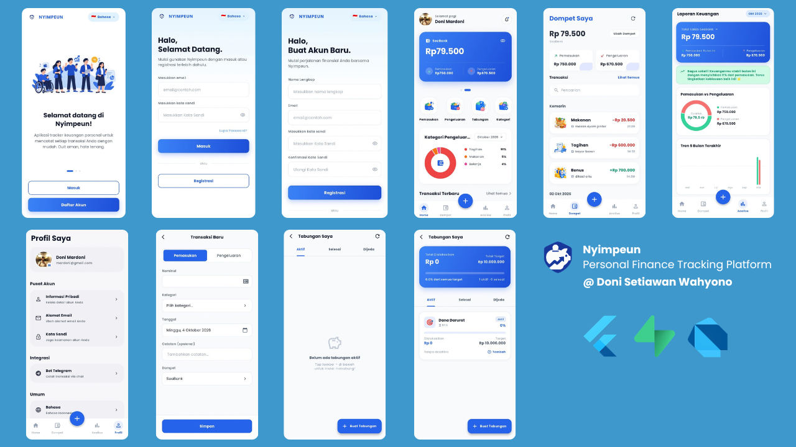

# Nyimpeun

A personal finance tracking mobile application built with Flutter. Nyimpeun helps users manage their income, expenses, and savings goals with a multi-wallet system, spending analytics, and a Telegram bot integration for recording transactions via natural language.

## Overview

Nyimpeun is a personal finance tracking application designed to simplify
daily financial record keeping. Users can manage multiple wallets,
record income, expenses, and transfers, monitor spending analytics,
and track savings goals.

In addition to the mobile application, Nyimpeun provides a Telegram
integration that allows users to record transactions using natural
language. The Telegram webhook processes messages through an LLM-based
transaction parser before storing the structured data in Supabase.

The application uses Supabase for authentication, PostgreSQL data
storage, Realtime synchronization, Storage, and Row Level Security
(RLS) to isolate user data.

## Features

- **Multi-wallet management** — Create and manage multiple wallets categorized as cash, bank, or e-wallet.
- **Transaction recording** — Log income, expense, and transfer transactions with category tagging, notes, and date.
- **Real-time sync** — Dashboard updates automatically via Supabase Realtime when transaction data changes.
- **Spending analytics** — Visual breakdown of income and expenses by category and time period using interactive charts.
- **Savings goals** — Create savings goals with target amounts, deadlines, and progress tracking linked to a wallet.
- **Telegram bot integration** — Link a Telegram account and record transactions via natural language messages processed by an LLM (with Groq, Gemini, and OpenAI as fallback providers).
- **Push notifications** — Receive transaction notifications via Firebase Cloud Messaging.
- **PIN lock** — Secure the app with a local PIN stored in device secure storage.
- **Onboarding flow** — First-launch onboarding screen with a seen state persisted locally.
- **Multi-language UI** — Interface supports Bahasa Indonesia and Basa Sunda, switchable at runtime.
- **Profile management** — Edit display name, avatar (via image picker), and password.

## Screenshots



## Tech Stack

| Layer | Technology |
| :--- | :--- |
| Framework | Flutter / Dart |
| State Management | Riverpod |
| Navigation | GoRouter |
| Backend / Database | Supabase / PostgreSQL |
| Edge Functions | Supabase Edge Functions / Deno / TypeScript |
| Push Notifications | Firebase Cloud Messaging |
| HTTP Client | Dio |
| Secure Storage | Flutter Secure Storage |
| Local Storage | SharedPreferences |
| Charts | FL Chart |
| Image Handling | Image Picker / Cached Network Image |
| Localization | Intl |
| Typography | Poppins |

## Architecture

The project follows a feature-first layered architecture, separating each feature into three layers:

- **data** — Datasources (Supabase calls via Dio / supabase_flutter), data models with JSON serialization, and repository implementations.
- **domain** — Pure Dart entities and abstract repository interfaces. No framework dependencies.
- **presentation** — Views (Flutter widgets), ViewModels (Riverpod `StateNotifier`/`AsyncNotifier` providers), and feature-scoped widgets.

Cross-cutting concerns are placed in shared directories:

- `lib/core/` — Theme, constants, network client (Dio with interceptor), storage abstractions, error types, utilities, and localization providers.
- `lib/shared/` — Shared data models and reusable UI widgets used across features.
- `lib/app/` — App entry widget, global Riverpod providers, and the GoRouter configuration.

Authentication state drives navigation through a `RouterNotifier` that listens to an auth state notifier and redirects to the appropriate route (onboarding, login, or dashboard) on state changes.

## Project Structure

```
lib/
├── main.dart                  # App entry point; initializes Supabase, Firebase, notifications
├── app/
│   ├── app.dart               # Root widget (MaterialApp.router)
│   ├── router/                # GoRouter configuration and route guards
│   ├── providers/             # Global Riverpod providers
│   └── widgets/               # App-level widgets
├── core/
│   ├── constants/             # App-wide constants (Supabase URLs, preference keys)
│   ├── errors/                # Custom exception types
│   ├── l10n/                  # Language enum and runtime language provider
│   ├── network/               # Dio client and API interceptor
│   ├── services/              # NotificationService (FCM)
│   ├── storage/               # LocalStorage (SharedPreferences) and SecureStorage wrappers
│   ├── theme/                 # Color palette and typography definitions
│   └── utils/                 # Formatting utilities
├── shared/
│   ├── models/                # Shared data models
│   └── widgets/               # Reusable UI components
└── features/
    ├── auth/                  # Login, register, profile, PIN, Telegram account linking
    ├── onboarding/            # First-launch onboarding screens
    ├── dashboard/             # Home screen with balance card, recent transactions, quick actions
    ├── wallet/                # Wallet list, transaction list, add/edit transaction
    ├── savings/               # Savings goals list and detail
    └── analytics/             # Spending breakdown charts and category analytics

supabase/
└── functions/
    └── telegram-webhook/      # Deno edge function: OTP linking and LLM-powered transaction parsing
```

## Getting Started

### Prerequisites

- Flutter SDK (see `pubspec.yaml` for the required Dart SDK version)
- A Supabase project with the schema applied from `supabase_schema.sql`
- A Firebase project with `google-services.json` (Android) placed in `android/app/`
- Supabase CLI (optional, for deploying edge functions)

### Setup

1. **Clone the repository**

   ```bash
   git clone <repository-url>
   cd nyimpeun
   ```

2. **Install dependencies**

   ```bash
   flutter pub get
   ```

3. **Configure Supabase credentials**

   Update `lib/core/constants/supabase_constants.dart` with your project URL and anon key:

   ```dart
   static const String url = '<YOUR_SUPABASE_URL>';
   static const String anonKey = '<YOUR_SUPABASE_ANON_KEY>';
   ```

4. **Apply the database schema**

   Run the SQL in `supabase_schema.sql` via the Supabase Dashboard SQL Editor.

5. **Run the app**

   ```bash
   flutter run
   ```

## Environment Configuration

The Supabase edge function (`supabase/functions/telegram-webhook/`) requires the following environment variables configured as Supabase secrets:

| Variable | Description |
|---|---|
| `TELEGRAM_BOT_TOKEN` | Telegram Bot API token |
| `SUPABASE_URL` | Supabase project URL |
| `SUPABASE_SERVICE_ROLE_KEY` | Supabase service role key (server-side only) |
| `GROQ_API_KEY` | Groq API key (primary LLM provider) |
| `GEMINI_API_KEY` | Google Gemini API key (secondary LLM fallback) |
| `OPENAI_API_KEY` | OpenAI API key (tertiary LLM fallback) |

To set secrets via the Supabase CLI:

```bash
supabase secrets set TELEGRAM_BOT_TOKEN=<value>
```

Do not commit actual secret values to the repository.

## Development

```bash
# Run the app in debug mode
flutter run

# Analyze code
flutter analyze

# Run tests
flutter test

# Build Android APK (release)
flutter build apk --release

# Deploy Supabase edge function
supabase functions deploy telegram-webhook

# Clean build artifacts
flutter clean
```

A `run_clean.ps1` PowerShell script is included at the project root as a convenience for cleaning and restarting the dev environment on Windows.

## Developer

**Doni Setiawan Wahyono**  
Software Engineer

- Instagram: [dnisetyaw](https://instagram.com/dnisetyaw)
- LinkedIn: [doni-setiawan-wahyono](https://linkedin.com/in/doni-setiawan-wahyono)
- Portfolio: [donisw.my.id](https://donisw.my.id)

## License

This project is licensed under the [MIT License](LICENSE).

